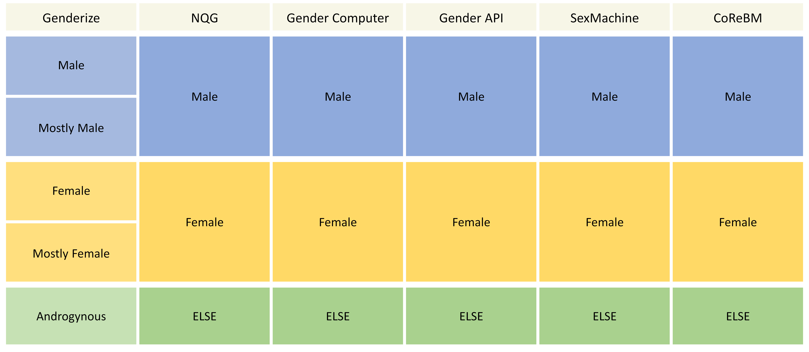
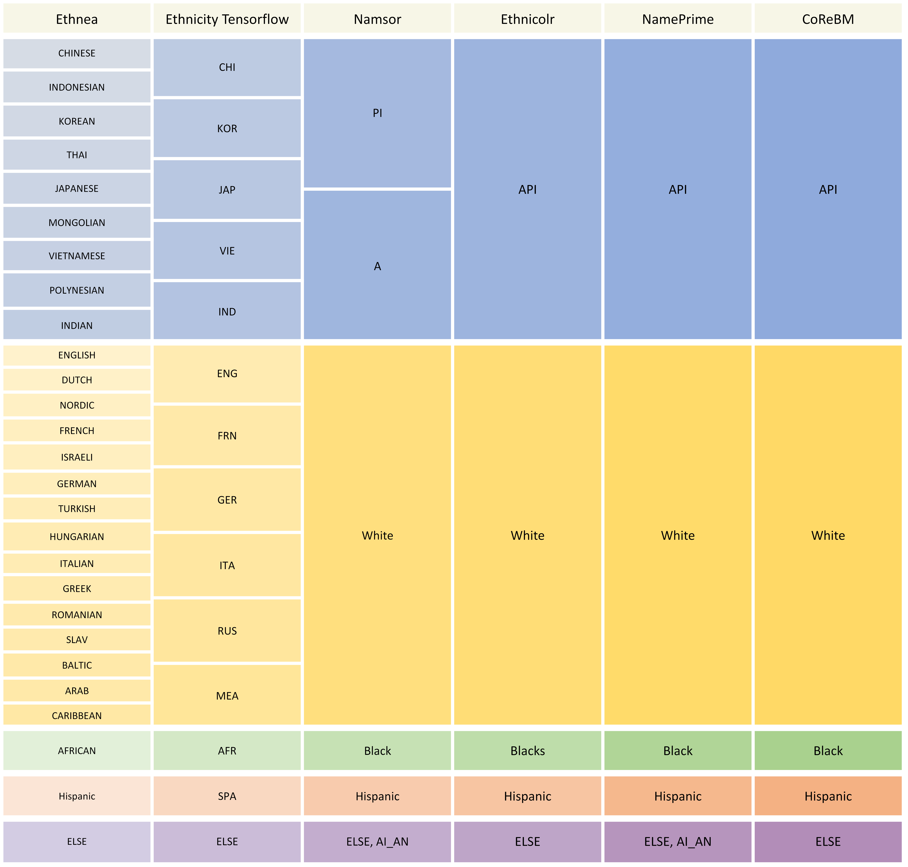

# CoReBM: A Code Reviewer Recommendation Method

## Introduction
This document is included in "***Building Bridges, Not Walls: Fairness-aware and Accurate Recommendation of Code Reviewers via LLM-based Agents Collaboration***“. We first collected a dataset from 4 large-scale open-source projects involving 50-month revision history, reaching up to 30 attributes. This dataset includes gender and racial/ethnic information, which was inferred, validated, and incorporated to enable comprehensive data bias analysis in reviewer recommendation tasks. Additionally, we introduce a fairness-aware and accurate LLM-based approach: CoReBM, which integrates diverse factors to improve recommendation performance while mitigating bias effects through the incorporation of candidates' gender and racial/ethnic attributes.

## General of Packages
- Baseline: Baseline method.
- Dataset: Dataset used in CoReBM.
- Implementation: Implementation of CoReBM.
- Tool: Prediction tools of gender and race/ethnicity.

## Usage Guide

### 1. Getting Started
If you want to try out our method, please copy all files located in the `/Implementation` folder and open them in a new project. You can choose to use either the command line or a browser.

### 2. Set up the Environment
Note: This environment is only related to the CoReBM.
1. Python version should be greater than to 3.10.13.
2. Install dependencies:
```shell
pip install -r requirements.txt
```

### 3. Dataset Preparation

We have two forms of data: raw data and usable datasets. The raw data consists of entries crawled from a website, while the usable datasets are derived from the raw data and processed into a format that can be used by the proposed method. Both of them can be downloaded from shared link.

#### 3.1 Raw Data
Due to GitHub's limitations, we have not yet uploaded the raw data to the repository. Please download the dataset here: [https://drive.google.com](https://drive.google.com/file/d/11JfeGkVqb4M3zKSJEWSw3iZ9bFIqWyrJ/view?usp=sharing)

Please extract the raw data *(files with the .jsonl extension)* into the `data/corebm/raw_data` folder.

#### 3.2 Usable Datasets

You can obtain the available datasets in two ways: by generating them through a script or downloading them from a cloud drive.

After placing the raw data files in the correct folder, run the script below. Once executed, the usable datasets will be generated in the `data/corebm/` folder with file extension `.csv`. Please note that this may take some time.

```shell
python main.py --main Preprocess --data_dir data/corebm --dataset corebm --n_neg_items 6
```

You can also download it here: [https://drive.google.com](https://drive.google.com/file/d/1QDnRupaTWR0IEr6yYBYnXcm7tHHFPIRG/view?usp=sharing). Please extract the datasets to the `data/corebm/` folder.

### 4. Configure API Key

To use this method, you need to set up the Large Language Model's API by specifying the API URL and Key. Please enter your API information in `config/api-config.json`.

### 5. Running the Proposed Method

#### Run With Command Line

```shell
python main.py --main Evaluate --data_file data/corebm/test.csv --system collaboration --system_config config/systems/collaboration/all_agents.json --task pr --rounds 1
```

The running log can be found in the `log/` folder, and the recommendation results are located in the `run/` folder.

#### Run With Browser

```shell
streamlit run web.py
```

Visit through `http://localhost:8501/`.

Usage Steps
- Step 1: Select an experimental sample from the number input box at the top of the page and preview the sample information.
- Step 2: Enter the maximum number of rounds for the recommendation task in the number input box at the bottom of the page.
- Step 3: Click the 'Start one round' button to begin.

Currently, our system supports generating recommendation results using existing datasets. In future updates, we will introduce an interactive user interface that enables users to input details of new code changes and receive personalized code reviewer suggestions.

## Case

We’ve provided a demo video to show how the proposed method works on webpage.

Video demo: [https://drive.google.com](https://drive.google.com/file/d/1PlVxi0RuWgpFWksKUCL4uUyrL5sTxbbk/view?usp=sharing)

## Gender and Race/Ethnicity Tools

### Overview

|                          Tool Name                           |      Description      |      Type      | # Output Category |
| :----------------------------------------------------------: | :-------------------: | :------------: | :---------------: |
| [Ethnea](http://abel.lis.illinois.edu/cgi-bin/ethnea/search.py) |    Webpage access     | Race/Ethnicity |        27         |
| [Ethnicity Tensorflow](https://github.com/63coldnoodle/ethnicity-tensorflow) | Reproduction required | Race/Ethnicity |        14         |
|                [Namsor](https://namsor.app/)                 |      API access       | Race/Ethnicity |         6         |
|     [Ethnicolr](https://github.com/appeler/ethnicolr_v2)     | Reproduction required | Race/Ethnicity |         5         |
|           [NamePrism](https://www.name-prism.com/)           |      API access       | Race/Ethnicity |         5         |
|              [Genderize](https://genderize.io/)              |      API access       |     Gender     |         5         |
|    [NQG](https://github.com/ianvanbuskirk/nomquamgender)     |    Python library     |     Gender     |         3         |
| [Gender Computer](https://github.com/tue-mdse/genderComputer) | Reproduction required |     Gender     |         3         |
|            [Gender API](https://gender-api.com/)             |      API access       |     Gender     |         3         |
|      [SexMachine](https://pypi.org/project/SexMachine/)      |    Python library     |     Gender     |         3         |

### Output Categories




